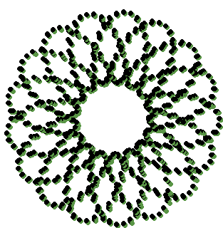
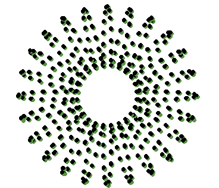
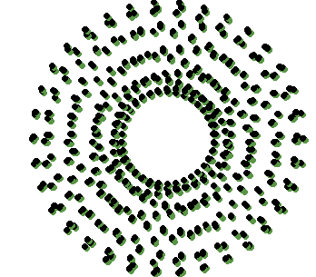
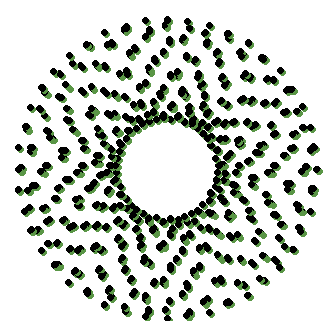
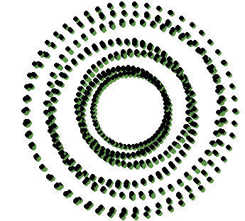
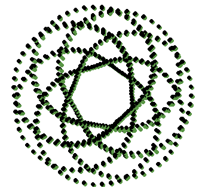
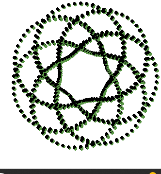
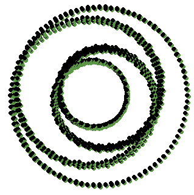
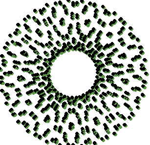
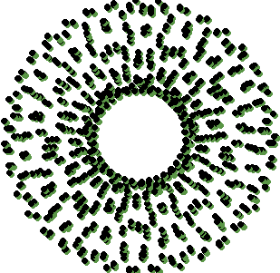

# titulo 1

## proyectos chidotes de Graficacion 2024

## Jose Vidal Lopez Casimiro 
## No. Control: 22121271

###  arriba yo 
### mi apa
### y tupac 

#### actividad 1 

``` python 
import cv2 as cv
import numpy as np
import math

# Cargar la imagen
img = cv.imread('bob.png', 0)

# Obtener el tamaño de la imagen
x, y = img.shape

# Crear una imagen vacía para almacenar el resultado
result_img = np.zeros((int(x * 1/5), int(y * 1/5)), dtype=np.uint8)

# Definir el ángulo de rotación (en grados) y convertirlo a radianes
angle = 60
theta = math.radians(angle)

# Definir la traslación
dx, dy = 10, 10

# Definir la escala
scale = 1/5

# Rotar, trasladar y escalar la imagen
for i in range(int(x * scale)):
    for j in range(int(y * scale)):
        # Calcular las coordenadas originales
        orig_x = int(i / scale)
        orig_y = int(j / scale)

        # Rotar la imagen
        rotated_x = int((orig_x - x // 2) * math.cos(theta) - (orig_y - y // 2) * math.sin(theta) + x // 2)
        rotated_y = int((orig_x - x // 2) * math.sin(theta) + (orig_y - y // 2) * math.cos(theta) + y // 2)

        # Trasladar la imagen
        translated_x = rotated_x + dx
        translated_y = rotated_y + dy

        # Verificar si las coordenadas están dentro de la imagen
        if 0 <= translated_x < x and 0 <= translated_y < y:
            result_img[i, j] = img[translated_x, translated_y]

# Mostrar la imagen original y la imagen resultante
cv.imshow('Imagen Original', img)
cv.imshow('Imagen Rotada, Trasladada y Escalada', result_img)
cv.waitKey(0)
cv.destroyAllWindows()
```

### actividad 2 
``` python 
import cv2 as cv
import numpy as np
import math

img = cv.imread('bob.png', 0)


x, y = img.shape

result_img = np.zeros((int(x * 2), int(y * 2)), dtype=np.uint8)

angle1 = -30
theta1 = math.radians(angle1)

angle2 = 60
theta2 = math.radians(angle2)

scale = 2

for i in range(int(x * scale)):
    for j in range(int(y * scale)):

        orig_x = int(i / scale)
        orig_y = int(j / scale)


        rotated_x1 = int((orig_x - x // 2) * math.cos(theta1) - (orig_y - y // 2) * math.sin(theta1) + x // 2)
        rotated_y1 = int((orig_x - x // 2) * math.sin(theta1) + (orig_y - y // 2) * math.cos(theta1) + y // 2)

        rotated_x2 = int((rotated_x1 - x // 2) * math.cos(theta2) - (rotated_y1 - y // 2) * math.sin(theta2) + x // 2)
        rotated_y2 = int((rotated_x1 - x // 2) * math.sin(theta2) + (rotated_y1 - y // 2) * math.cos(theta2) + y // 2)

        if 0 <= rotated_x2 < x and 0 <= rotated_y2 < y:
            result_img[i, j] = img[rotated_x2, rotated_y2]


cv.imshow('Original Image', img)
cv.imshow('Rotated, Rotated, and Scaled Image', result_img)
cv.waitKey(0)
cv.destroyAllWindows()
```

### actividad 3 

```
import cv2 as cv
import numpy as np
import math

img = cv.imread('bob.png', 0)


x, y = img.shape


result_img = np.zeros((int(x * 2), int(y * 2)), dtype=np.uint8)


angle = 70
theta = math.radians(angle)


dx, dy = 20, 20


scale = 2


for i in range(int(x * scale)):
    for j in range(int(y * scale)):

        orig_x = int(i / scale)
        orig_y = int(j / scale)

        rotated_x = int((orig_x - x // 2) * math.cos(theta) - (orig_y - y // 2) * math.sin(theta) + x // 2)
        rotated_y = int((orig_x - x // 2) * math.sin(theta) + (orig_y - y // 2) * math.cos(theta) + y // 2)

        translated_x = rotated_x + dx
        translated_y = rotated_y + dy

        if 0 <= translated_x < x and 0 <= translated_y < y:
            result_img[i, j] = img[translated_x, translated_y]

cv.imshow('Original Image', img)
cv.imshow('Rotated, Translated, and Scaled Image', result_img)
cv.waitKey(0)
cv.destroyAllWindows()
```

#### actividad de animaciones parametricas.













### actividad Pelitita en Movimiento
```
import numpy as np
import cv2 as cv

# Iniciar la captura de video desde la cámara
cap = cv.VideoCapture(0)

# Verificar si la cámara se abrió correctamente
if not cap.isOpened():
    print("Error al abrir la cámara")
    exit()

# Obtener las dimensiones del video (ancho y alto de la cámara)
frame_width = int(cap.get(cv.CAP_PROP_FRAME_WIDTH))
frame_height = int(cap.get(cv.CAP_PROP_FRAME_HEIGHT))

# Parámetros para el flujo óptico Lucas-Kanade
lk_params = dict(winSize=(15, 15), maxLevel=2,
                 criteria=(cv.TERM_CRITERIA_EPS | cv.TERM_CRITERIA_COUNT, 10, 0.03))

# Leer el primer frame de la cámara
ret, first_frame = cap.read()

if not ret:
    print("Error al capturar el primer frame")
    cap.release()
    exit()

first_frame = cv.flip(first_frame, 1)
prev_gray = cv.cvtColor(first_frame, cv.COLOR_BGR2GRAY)

# Posición inicial de la pelotita (centrada en la imagen)
ball_pos = np.array([[frame_width // 2, frame_height // 2]], dtype=np.float32)
ball_pos = ball_pos[:, np.newaxis, :]

# Definir el recuadro azul 
margin = 50  # margen para ajustar el tamaño del rectángulo
rect_top_left = (margin, margin)
rect_bottom_right = (frame_width - margin, frame_height - margin)

while True:
    # Capturar el siguiente frame
    ret, frame = cap.read()
    if not ret:
        print("Error al capturar frame")
        break

    frame = cv.flip(frame, 1)

    # Convertir el frame a escala de grises
    gray_frame = cv.cvtColor(frame, cv.COLOR_BGR2GRAY)

    # Calcular el flujo óptico para mover la pelotita
    new_ball_pos, st, err = cv.calcOpticalFlowPyrLK(prev_gray, gray_frame, ball_pos, None, **lk_params)

    # Si se detecta el nuevo movimiento, actualizar la posición de la pelotita
    if new_ball_pos is not None:
        ball_pos = new_ball_pos

        # Obtener las coordenadas de la pelotita
        a, b = ball_pos.ravel()

        # Verificar si la pelotita se acerca a los bordes del rectángulo azul
        if (a <= rect_top_left[0] + 20 or a >= rect_bottom_right[0] - 20 or
                b <= rect_top_left[1] + 20 or b >= rect_bottom_right[1] - 20):
            # Si se acerca a los bordes, volver al centro
            ball_pos = np.array([[frame_width // 2, frame_height // 2]], dtype=np.float32)
            ball_pos = ball_pos[:, np.newaxis, :]

        # Dibujar la pelotita en su nueva posición
        a, b = ball_pos.ravel()
        frame = cv.circle(frame, (int(a), int(b)), 20, (0, 255, 0), -1)

    # Dibujar el recuadro azul (casi del tamaño de la pantalla)
    frame = cv.rectangle(frame, rect_top_left, rect_bottom_right, (255, 0, 0), 5)

    # Mostrar solo una ventana con la pelotita en movimiento
    cv.imshow('Pelota en movimiento', frame)

    # Actualizar el frame anterior para el siguiente cálculo
    prev_gray = gray_frame.copy()

    # Presionar 'Esc' para salir
    if cv.waitKey(30) & 0xFF == 27:
        break

# Liberar la captura y destruir todas las ventanas
cap.release()
cv.destroyAllWindows()
```

### Actividad Filtros como el Snap


### Actividad imagen convolucion 
```
import cv2 as cv
import numpy as np

# Cargar la imagen en escala de grises
img = cv.imread('bob.png', 0)

# Obtener el tamaño original de la imagen
x, y = img.shape

# Crear una nueva imagen para el escalado al doble
scaled_img = np.zeros((x * 2, y * 2), dtype=np.uint8)

# Escalar la imagen al doble utilizando ciclos for
for i in range(x * 2):
    for j in range(y * 2):
        # Encontrar los índices correspondientes en la imagen original
        orig_x = i // 2
        orig_y = j // 2
        # Copiar el valor del píxel de la imagen original
        scaled_img[i, j] = img[orig_x, orig_y]

# Crear una nueva imagen para almacenar la versión suavizada
smoothed_img = np.zeros_like(scaled_img)

# Aplicar suavizado usando un filtro de promedio de 3x3
for i in range(1, scaled_img.shape[0] - 1):
    for j in range(1, scaled_img.shape[1] - 1):
        # Tomar el promedio de un bloque de 3x3 alrededor del píxel central
        neighborhood = scaled_img[i-1:i+2, j-1:j+2]
        smoothed_img[i, j] = np.mean(neighborhood)

# Mostrar la imagen original, la escalada y la suavizada
cv.imshow('Imagen Original', img)
cv.imshow('Imagen Escalada x2', scaled_img)
cv.imshow('Imagen Suavizada', smoothed_img)
cv.waitKey(0)
cv.destroyAllWindows()

```

### Actividad de convolucion entre separables y una matriz, comparacion en tiempos 
```
import cv2 as cv
import numpy as np
import time

# Cargar la imagen en escala de grises
img = cv.imread('black.png', 0)

# Obtener el tamaño original de la imagen
x, y = img.shape

# Crear una nueva imagen para el escalado al doble
scaled_img = np.zeros((x * 2, y * 2), dtype=np.uint8)

# Escalar la imagen al doble utilizando ciclos for
for i in range(x * 2):
    for j in range(y * 2):
        orig_x = i // 2
        orig_y = j // 2
        scaled_img[i, j] = img[orig_x, orig_y]

# Crear los kernels (matrices) de convolución
# Kernel 1D para las direcciones horizontal y vertical
kernel_horizontal = np.array([[1, 2, 1]])
kernel_vertical = np.array([[1], [2], [1]])

# Kernel 2D para la segunda convolución
kernel_2d = np.array([
    [1, 2, 1],
    [2, 0, 2],
    [1, 2, 1]
])

# Aplicar convolución con el kernel 1D en ambas direcciones
start_time = time.time()
convoluted_img_1d = cv.filter2D(scaled_img, -1, kernel_horizontal)  # Filtro horizontal
convoluted_img_1d = cv.filter2D(convoluted_img_1d, -1, kernel_vertical)  # Filtro vertical
time_1d = time.time() - start_time

# Aplicar convolución con el kernel 2D
start_time = time.time()
convoluted_img_2d = cv.filter2D(scaled_img, -1, kernel_2d)
time_2d = time.time() - start_time

# Mostrar resultados y tiempos de ejecución
print(f"Tiempo de convolución con vectores [1, 2, 1]: {time_1d:.4f} segundos")
print(f"Tiempo de convolución con matriz [[1, 2, 1], [2, 0, 2], [1, 2, 1]]: {time_2d:.4f} segundos")

# Mostrar las imágenes originales y con convolución
cv.imshow('Imagen Original', img)
cv.imshow('Imagen Escalada x2', scaled_img)
cv.imshow('Imagen Convolución 1D [1, 2, 1]', convoluted_img_1d)
cv.imshow('Imagen Convolución 2D [[1, 2, 1], [2, 0, 2], [1, 2, 1]]', convoluted_img_2d)
cv.waitKey(0)
cv.destroyAllWindows()
```

## actividad del triangulo de pascal
### chidota
```import pygame
from pygame.locals import *
from OpenGL.GL import *
import math

# Configuración inicial
width, height = 800, 600  # Tamaño de la ventana
filas = 10  # Número de filas del Triángulo de Pascal

def generar_triangulo_pascal(n):
    """Generar el Triángulo de Pascal como una lista de listas"""
    triangulo = []
    for i in range(n):
        fila = [1]
        if triangulo:
            ultima_fila = triangulo[-1]
            for j in range(len(ultima_fila) - 1):
                fila.append(ultima_fila[j] + ultima_fila[j + 1])
            fila.append(1)
        triangulo.append(fila)
    return triangulo

def inicializar_opengl():
    """Inicializar OpenGL sin GLUT"""
    glClearColor(0.0, 0.0, 0.0, 1.0)  # Fondo negro
    glViewport(0, 0, width, height)  # Usar toda la ventana
    glMatrixMode(GL_PROJECTION)
    glLoadIdentity()
    glOrtho(-1.0, 1.0, -1.0, 1.0, -1.0, 1.0)  # Sistema de coordenadas ortográfico
    glMatrixMode(GL_MODELVIEW)
    glLoadIdentity()

def dibujar_triangulo_pascal(triangulo):
    """Dibujar el Triángulo de Pascal"""
    glClear(GL_COLOR_BUFFER_BIT | GL_DEPTH_BUFFER_BIT)
    glPointSize(5)  # Tamaño de los puntos

    base_x, base_y = 0.0, 0.9  # Coordenadas base
    espacio_x = 0.1  # Espaciado horizontal
    espacio_y = 0.1  # Espaciado vertical

    for i, fila in enumerate(triangulo):
        x_offset = -espacio_x * (len(fila) - 1) / 2  # Centramos cada fila
        for j, valor in enumerate(fila):
            glBegin(GL_POINTS)
            # Colores para pares e impares
            if valor % 2 == 0:
                glColor3f(0.0, 0.5, 1.0)  # Azul para pares
            else:
                glColor3f(1.0, 0.5, 0.0)  # Naranja para impares
            glVertex2f(base_x + x_offset, base_y - i * espacio_y)
            glEnd()
            x_offset += espacio_x  # Incrementar posición x

    pygame.display.flip()

def main():
    """Función principal"""
    pygame.init()
    pygame.display.set_mode((width, height), DOUBLEBUF | OPENGL)
    pygame.display.set_caption("Triángulo de Pascal - OpenGL")

    inicializar_opengl()
    triangulo = generar_triangulo_pascal(filas)

    running = True
    while running:
        for event in pygame.event.get():
            if event.type == QUIT:
                running = False
            elif event.type == KEYDOWN and event.key == K_ESCAPE:
                running = False

        dibujar_triangulo_pascal(triangulo)

    pygame.quit()

if __name__ == "__main__":
    main()


```
### trabajo individual 
```
import cv2
import glfw
from OpenGL.GL import *
from OpenGL.GLU import *
import sys

# Variables globales
window = None
x_opengl = 0.0
y_opengl = 0.0
scale = 0.2
angle_x = 0
angle_y = 0  

video = cv2.VideoCapture(0)

def init():
    """Inicializa OpenGL"""
    glClearColor(0.0, 0.0, 0.0, 1.0) 
    glEnable(GL_DEPTH_TEST)

    glMatrixMode(GL_PROJECTION)
    glLoadIdentity()
    gluPerspective(45, 640 / 480, 1.0, 50.0) 

    glMatrixMode(GL_MODELVIEW)

def draw_prism(x, y, scale, angle_x, angle_y):
    """Dibuja un prisma rectangular con gestos"""
    glPushMatrix()
    glTranslatef(x, y, -5.0)  
    glScalef(scale, scale * 1.5, scale) 
    glRotatef(angle_x, 1, 0, 0) 
    glRotatef(angle_y, 0, 1, 0)  


    glBegin(GL_QUADS)

    glColor3f(1.0, 0.0, 0.0)
    glVertex3f(1, 1, -1)
    glVertex3f(-1, 1, -1)
    glVertex3f(-1, 1, 1)
    glVertex3f(1, 1, 1)

    glColor3f(0.0, 1.0, 0.0)
    glVertex3f(1, -1, 1)
    glVertex3f(-1, -1, 1)
    glVertex3f(-1, -1, -1)
    glVertex3f(1, -1, -1)

    glColor3f(0.0, 0.0, 1.0)
    glVertex3f(1, 1, 1)
    glVertex3f(-1, 1, 1)
    glVertex3f(-1, -1, 1)
    glVertex3f(1, -1, 1)

    glColor3f(1.0, 1.0, 0.0)
    glVertex3f(1, -1, -1)
    glVertex3f(-1, -1, -1)
    glVertex3f(-1, 1, -1)
    glVertex3f(1, 1, -1)

    glColor3f(1.0, 0.0, 1.0)
    glVertex3f(-1, 1, 1)
    glVertex3f(-1, 1, -1)
    glVertex3f(-1, -1, -1)
    glVertex3f(-1, -1, 1)

    glColor3f(0.0, 1.0, 1.0)
    glVertex3f(1, 1, -1)
    glVertex3f(1, 1, 1)
    glVertex3f(1, -1, 1)
    glVertex3f(1, -1, -1)
    glEnd()

    glPopMatrix()

def process_frame():
    """Procesa el video y actualiza las coordenadas del prisma"""
    global x_opengl, y_opengl, angle_x, angle_y
    ret, frame = video.read()
    if not ret:
        return

    frame_gray = cv2.cvtColor(frame, cv2.COLOR_BGR2GRAY)
    frame_blur = cv2.GaussianBlur(frame_gray, (15, 15), 0)
    _, thresh = cv2.threshold(frame_blur, 60, 255, cv2.THRESH_BINARY_INV)
    contours, _ = cv2.findContours(thresh, cv2.RETR_EXTERNAL, cv2.CHAIN_APPROX_SIMPLE)

    if contours:
        max_contour = max(contours, key=cv2.contourArea)
        x, y, w, h = cv2.boundingRect(max_contour)


        new_x_opengl = (x + w / 2) / frame.shape[1] * 2 - 1
        new_y_opengl = -((y + h / 2) / frame.shape[0] * 2 - 1)


        dx = new_x_opengl - x_opengl
        dy = new_y_opengl - y_opengl


        x_opengl = new_x_opengl
        y_opengl = new_y_opengl
        angle_x = dy * 20  
        angle_y = dx * 20 
    else:

        angle_x, angle_y = 0, 0

def main():
    """Función principal"""
    global window


    if not glfw.init():
        print("Error: GLFW no pudo inicializarse")
        sys.exit()

    width, height = 640, 480
    window = glfw.create_window(width, height, "Prisma controlado con la mano", None, None)

    if not window:
        print("Error: No se pudo crear la ventana GLFW")
        glfw.terminate()
        sys.exit()

    glfw.make_context_current(window)
    glViewport(0, 0, width, height)
    init()


    while not glfw.window_should_close(window):
        glClear(GL_COLOR_BUFFER_BIT | GL_DEPTH_BUFFER_BIT)
        glLoadIdentity()


        process_frame()
        draw_prism(x_opengl, y_opengl, scale, angle_x, angle_y)

        glfw.swap_buffers(window)
        glfw.poll_events()


    glfw.terminate()
    video.release()
    cv2.destroyAllWindows()


if __name__ == "__main__":
    main()
```
